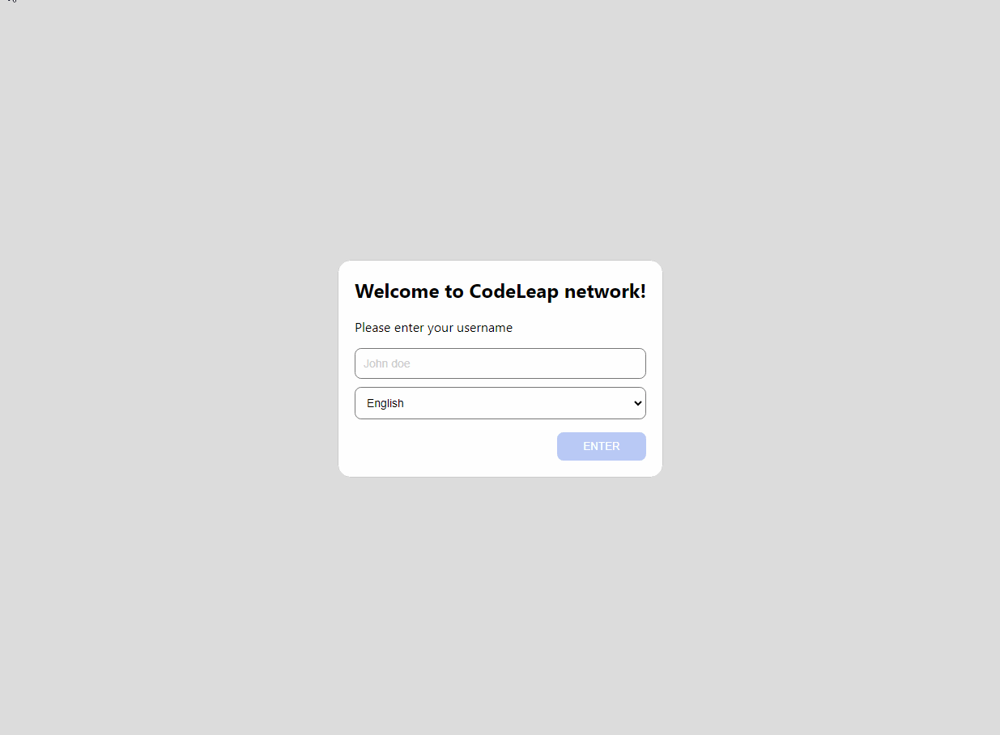

# :bat: Olá, seja bem vindo(a). :bat:
#### Esse foi meu primeiro projeto utilizando Redux para gerenciamento de estado (e eu gostei :grin:).
#### A proposta é uma aplicação em que o usuário consiga fazer postagens contendo título e conteúdo em texto e deverá ser possível para o usuário criar, editar e excluir esses posts.
#### Assim, segue a lista de features que foram feitas na aplicação:
- Login
- Logout
- Postagens
    - Criar
    - Editar
    - Excluir
- Mudar idioma para pt-:brazil: ou en-:us:
- Infinite Scroll

